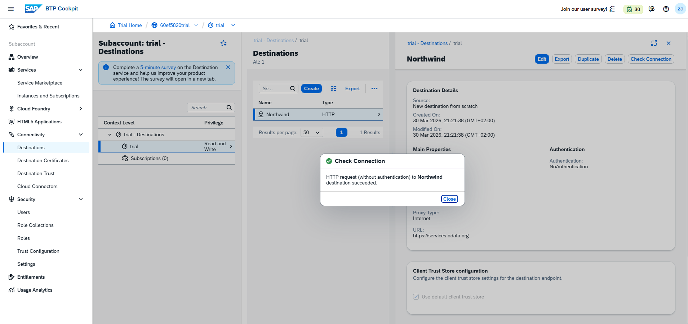
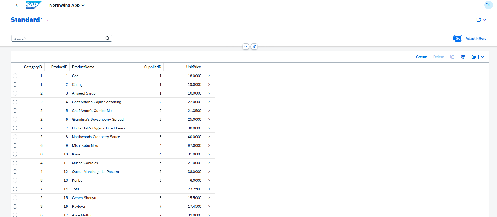

## Northwind fiori app
This project is a simple SAP Fiori List Report application built on SAP BTP using BAS.  
It connects to the Northwind OData service and displays product data in a clean UI.

---

## Architecture Overview

The application is developed in BAS and uses a destination configured in BTP to connect to an external OData service (Northwind).
The Fiori app consumes the data through the destination, and the data is displayed using a standard List Report template
---

## Setup Instructions

1. Created SAP BTP Trial account
2. Opened BTP Cockpit and accessed the subaccount
3. Subscribed to:
   - Business Application Studio
   - Destination Service
4. Assigned Developer role to my user
5. Created a destination:
   - Name: Northwind
   - URL: https://services.odata.org
   - Authentication: NoAuthentication
   - Proxy Type: Internet
   - WebIDEEnabled: true
   - WebIDEUsage: odata_gen
6. Opened BAS and created a Dev Space (SAP Fiori)
7. Created a new Fiori Application (List Report)
8. Connected to OData service
9. Selected Products entity
10. Ran the app and confirmed data is displayed

---

## OData Entity Used

I used the **Products** entity.

It contains useful fields like ProductID, ProductName, UnitPrice, that make it easy to display and understand the data

---

## Challenges Faced

One issue I encontered was connecting to the OData service in BAS.

The instructions said that the service path should be:

/V2/Northwind/Northwind.svc/

However, that did not work for me and i couldn't even click next.

After trying a few things and faced with many errors, I realized that BAS required the full URL instead of just the path.  
So I used:

https://services.odata.org/V2/Northwind/Northwind.svc

After using the full URL, the service connected successfully and I was able to proceed.

---

## Screenshots

### Destination Configuration

### Application Preview

